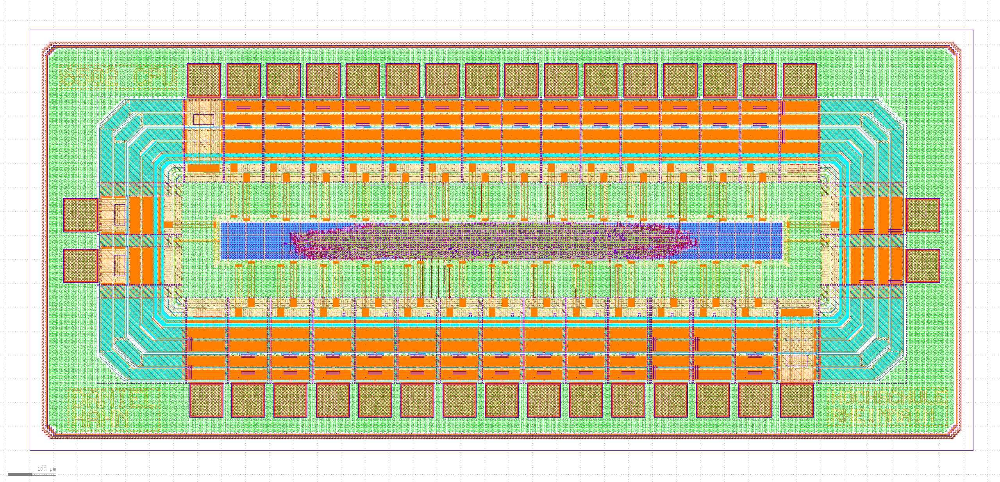

# Open-Source 6502 ASIC Implementation
This project offers an open-source 6502, fully implemented in Verilog, designed to work seamlessly with the OpenROAD toolchain. The design is tailored for use with the [IHP SG13G2 PDK](https://github.com/IHP-GmbH/IHP-Open-PDK), providing a complete open-source solution from RTL to GDSII without any reliance on proprietary software.

The design has been tested in a cocotb testbench and on a Lattice ECP5 FPGA and has been submitted to the [April 2025 SG13G2 Tapeout](https://github.com/IHP-GmbH/TO_Apr2025). Finished silicon will hopefully be received by the end of 2025.




The design is not fully compatible with the original 6502. Only the legal opcodes have been implemented and tested. Also opcodes might take less clock cycles than on the original 6502. On the original 6502 some inefficiencies were accepted to keep the design small and simple. With modern hardware design languages this is not necessary anymore. Therefor the complete statemachine has been reimplemented so that all instructions take the same amount or less clock cycles than in the original design.
Some pins like SO, SYNC, RDY, HALT, NMI, IRQ have been removed to save space on the DIE and make the manufacturing more affordable.

## Setup Development Environment
You can follow [these instructions](OpenRoad-docker-setup.md) to install the complete OpenRoad toolchain inside a docker container without bloating your host system. You might still want to check out the [official instructions](https://openroad.readthedocs.io/en/latest/user/Build.html) because OpenRoad is very actively developed and things might change.


## OpenRoad Build
Clone this repo and copy (or even better, symlink) the `design/` and `src/` directories into your `OpenROAD-flow-scripts` directory:
```
cp -r ASIC/design ~/OpenROAD-flow-scripts/flow/designs/ihp-sg13g2/6502_cpu
cp -r ASIC/src ~/OpenROAD-flow-scripts/flow/designs/src/6502_cpu
```

Build the design:
```
cd ~/OpenROAD-flow-scripts
. env.sh
cd flow
make DESIGN_CONFIG=./designs/ihp-sg13g2/6502_cpu/config.mk
```

If everything goes well you should be able to open the design with the OpenROAD GUI:
```
make DESIGN_CONFIG=./designs/ihp-sg13g2/6502_cpu/config.mk gui_final
```

There are comments in the TODO_config-mk_link file describing how the DIE_AREA and CORE_ARE are calculated, how the sealring is generated, and how the DRC checks are run inside klayout.


## Cocotb Test
<!-- TODO: remove interrupts -->
Simply run `make` inside the `cocotb-testbench` directory.

The testbench will emulate the memory, preloaded with the `test.bin` program. The state of the CPU and memory are saved before and after every instruction. The changes are then compared with the expected behavior.

If you want to run your own binary, you can modify the `test.65s` assembler code and use the [Masswerk Virtual 6502 Assembler](https://www.masswerk.at/6502/assembler.html) to assemble it. Download the *"Standard Binary"* and save it as `test.bin`.

## FPGA Test
<!-- TODO: remove interrupts -->
To test the design on an FPGA the [Radiona ULX3S](https://radiona.org/ulx3s/) board was used for its good support in open-source tools.
To synthesize and program the FPGA, the [oss-cad-suite](https://github.com/YosysHQ/oss-cad-suite-build/releases) is used. Because the oss-cad-suite is a self-contained collection of binaries and will not bloat your system by installing hundreds of packages through your package manager, it can be used directly on your host system. You can also use the oss-cad-suite that should be installed in the previously set-up docker container, but you have to figure out USB passthrough for programming.

```
source oss-cad-suite/environment
cd fpga-test
./shrink-memory.sh
make prog
```

The RAM is synthesized using flip-flops, which is extremely space-inefficient on the FPGA. As a result, the full 65KB of RAM will not fit on the FPGA. However, since the test program does not require the entire memory, only a 4096-byte RAM is synthesized. This RAM maps the first 4096 bytes and the last 16 bytes of the address space. The address translation is handled within the RAM Verilog module. A more efficient approach would be to use the internal BRAMs of the ECP5 FPGA. However, the above workaround works well for testing and does not require platform-specific Verilog code.

If you want to run your own binary, you can modify the `test.65s` assembler code and use the [Masswerk Virtual 6502 Assembler](https://www.masswerk.at/6502/assembler.html) to assemble it. Download the *"Standard Binary"* and save it as `test.bin`. The `shrink-memory.sh` script has to be executed, to strip the center region of the binary and save a hexdump version of it as `test_fpga.hex`. This file will then be used to initialize the FPGA RAM when programming.

The current design uses gated clocks, which is not considered good practice in FPGA design, but is good enough for testing the design.

The clk, data bus and RW pin are connected to GPIOs 0-9 of the Radiona board. Reset is connected to the left button of the on-board D-Pad. A logic analyzer can be used to verify that the design is working correctly.


